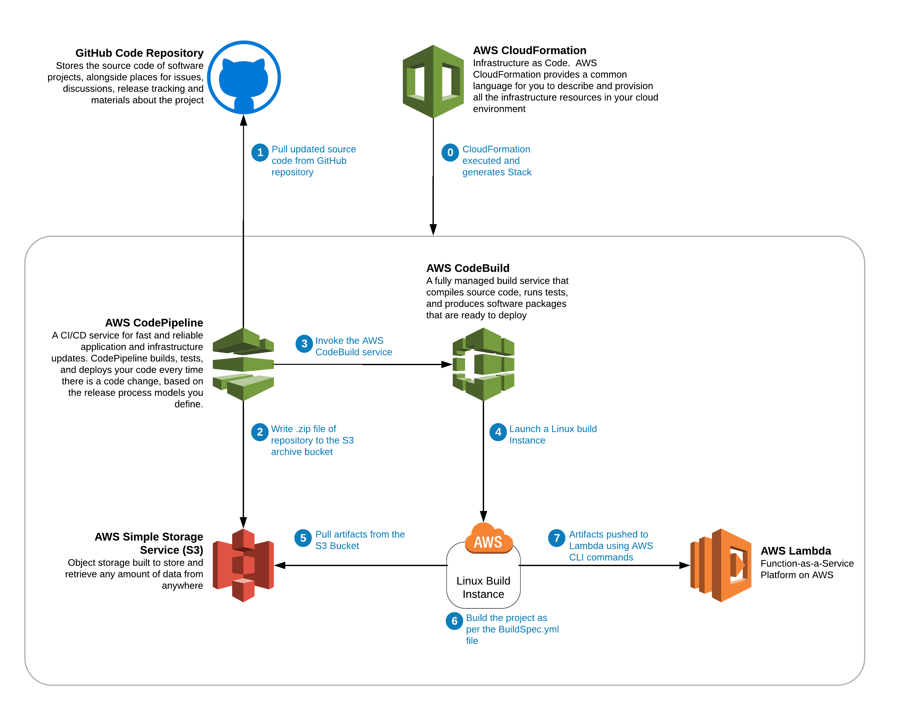

# Workshop: Deploying Lambda Functions using AWS Code Build and Code Pipeline CI/CD Tools

## Overview

This workshop is intended to take you on a short tour of using AWS CodeBuild and CodePipeline to automate your code 
deployment.  The workshop will guide you through the process of taking your code from a GitHub repository all the way 
through to a fully deployed Lambda function.  Note that this fully automated pipeline will use no servers and will have 
no infrastructure to maintain.  The pipeline will use CloudFormation templates to define and manage the process.  In 
this workshop you will explore the sections of the CloudFormation template, identify your buildspec.yaml file, and 
deploy your pipeline automation.

Note: This workshop will build on the Lambda 101 Workshop Artifacts.  If you do not have these Artifacts, please redo
The Lambda Funcitons 101 workshop or run this CloudFormation Template: <**Link Coming soon**>.

## Prerequisites
* Pre-read(or watch): [CloudFormation Overview Video Podcast](https://youtu.be/dtkZQfuaRyI)
* AWS account for use in the workshop (all resources should be free tier)
* A GitHub account that you can create a temporary repository for this exercise
* Workshop: Lambda Functions 101

## What you are building

## How you will build it
**Section 1: Setup GitHub for use by Cloud Formation
* Create a personal access token.  
* Fork the source repo to your account

**Section 2: Create CloudFormation Stack**
* Review the sections of the Cloud Formation Template
* Launch the CloudFormation Stack
* Verify that the stack successfully completes  

**Section 3: Test deployed Lambda Function** 
* Setup a test event for your newly created function
* Run a test event and verify that you Lambda works

**Section 4: Update index.js in github.com**
* Manually change a value in index.js in Github
* Verify that the CodePipeline responds to the change and successfully deploys
* Add Another record to DynamoDB (Not yet in pdf.  Refer to the pdf in Lambda Functions 101 workshop)

**Section 5: Confirm updated Lambda Function**
* Run a test even and verify that your changes are updated in Lambda

## Step-by-Step Instructions
Click [here](WorkshopForLambdaCICD.pdf) for the pdf file of step-by-step instructions

## Getting Started

## Coming soon
* **Workshop:** Lambda Functions 201 (Triggering Events)
* **Workshop:** API Gateway with Lambda Functions

## References

* [AWS CloudFormation User Guide](https://docs.aws.amazon.com/AWSCloudFormation/latest/UserGuide/Welcome.html)

* [CloudFormation Lambda Resources](https://docs.aws.amazon.com/AWSCloudFormation/latest/UserGuide/aws-resource-lambda-function.html)
